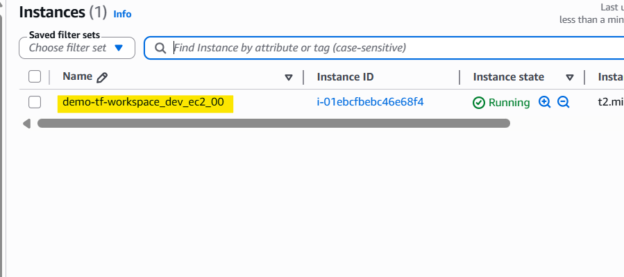
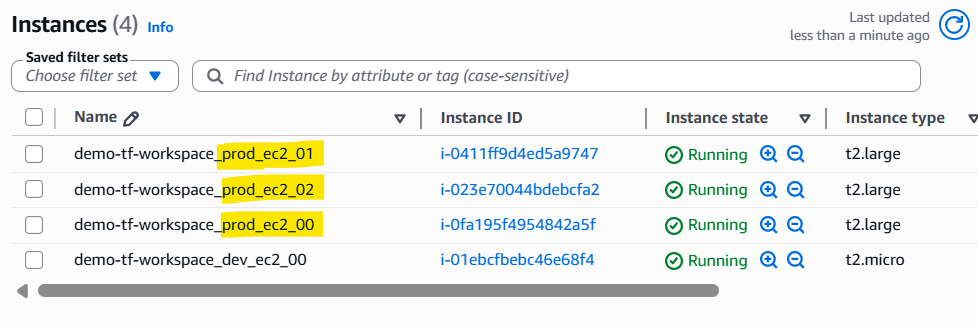
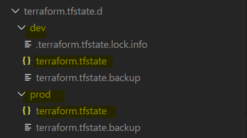

# Terraform — Workspace Demo

> Demonstrates Terraform workspaces by provisioning environment-specific AWS infrastructure from a single configuration. Switching workspaces changes the resource count and instance type without touching any code.

**Stack:** AWS (ca-central-1) · VPC + private subnet + EC2 · local backend

---

## Workspace

- `Terraform workspace`
  - a feature that manages **multiple separate state** files **using a single Terraform configuration**.

- Workspace in projecg

|               | `dev`    | `prod`   |
| ------------- | -------- | -------- |
| EC2 count     | 1        | 3        |
| Instance type | t2.micro | t2.large |

Resource names are tagged automatically as `<project>_<workspace>_<resource>`.

## Key pattern

```hcl
resource "aws_instance" "app" {
  count         = terraform.workspace == "prod" ? 3 : 1
  instance_type = terraform.workspace == "prod" ? "t2.large" : "t2.micro"

  tags = {
    Name        = format("%s_%s_ec2_%02d", var.project_name, terraform.workspace, count.index)
    Environment = terraform.workspace
  }
}
```

## Quick start

```sh
cd infra
terraform init
terraform workspace new dev
terraform workspace new prod

# switch and apply
terraform workspace select dev
terraform apply -auto-approve

terraform workspace select prod
terraform apply -auto-approve
```

## Screenshots

Dev workspace



Prod workspace



State isolation


